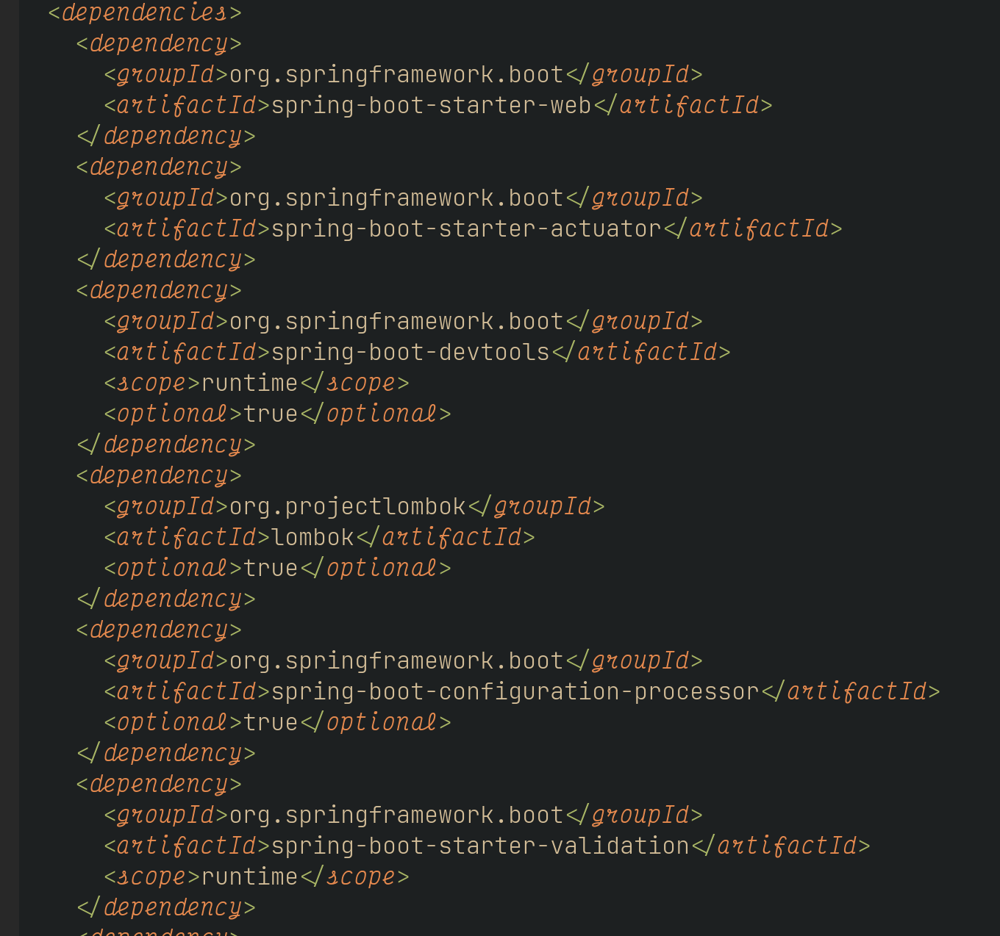
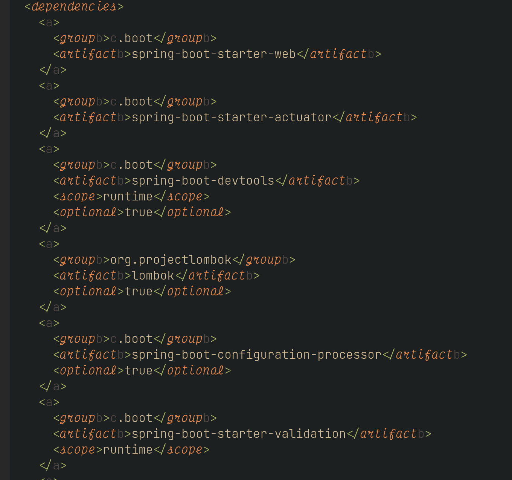
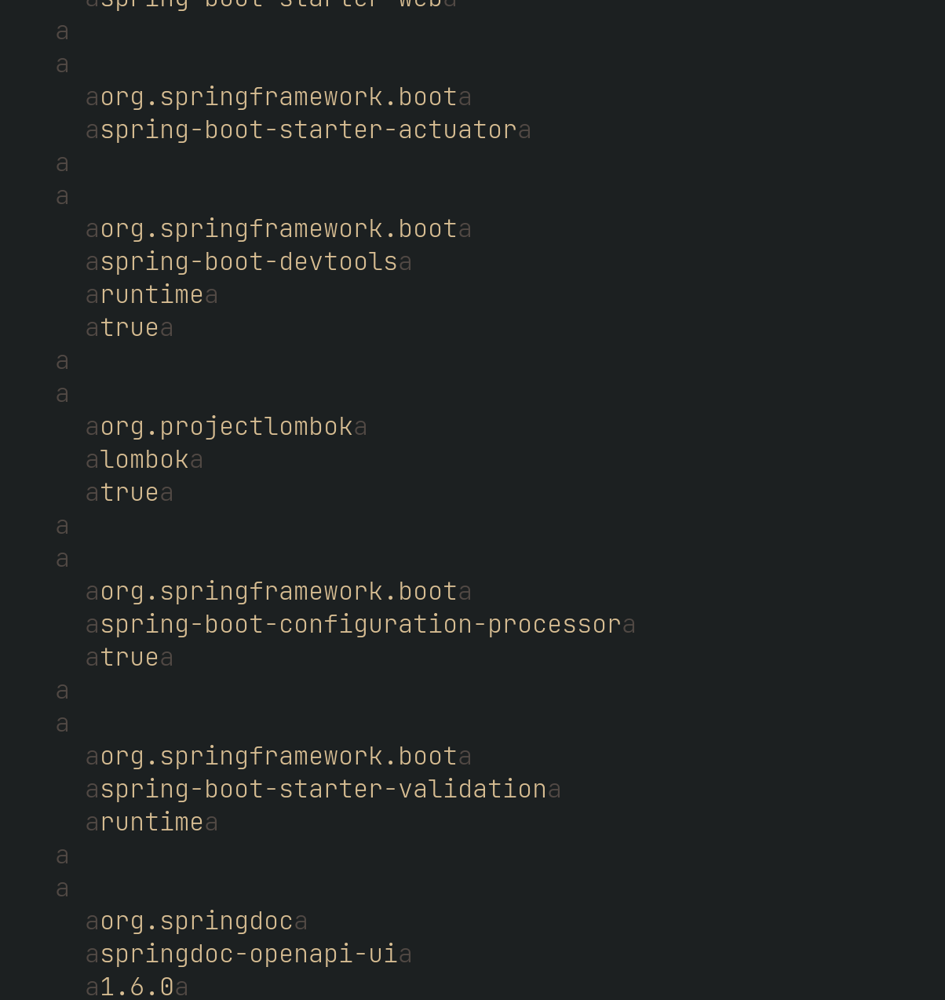

Overview
========

This Vim plugin lets you hide patterns of a buffer's content without modification, using Vim's [conceal](https://vimhelp.org/syntax.txt.html#conceal) feature.

Use
---

Imagine you have a file, full of uninteresting tags and text:

This plugin lets you hide distracting text:

1. Don't want to see "dependency"? Type `:SearchConceal 'dependency'` (or some other regular expression)
2. All matches are concealed with an "a".
3. Maybe you find "Id" too redundant. You can search for `/Id`, and then type `:SearchConceal` to conceal all the matches (by default the `:SearchConceal` command uses the pattern in the `@/` register).
4. The second match is concealed with a "b".
5. A third concealed pattern uses "c", 4th "d", 5th, "e", etc

Using regular expressions lets you hide arbitrary patterns. For example, hiding the content of all tags with `/<[^>]*>` and the command
`:SearchConceal` (or maybe as a one liner in a script `:SearchConceal '<[^>]*>'`):

When you want to see everything again, type `:SearchConcealClear`.

Installation
------------

Use your favorite plugin manager to install the vim-searchconceal.

Vundle:

    Plugin 'dsummersl/vim-searchconceal'

    " Add mappings if desired:
    map <leader>ch :SearchConceal<CR>
    map <leader>cc :SearchConcealClear<CR>

Packer:

    use {'dsummersl/vim-searchconceal', config = function()
      vim.cmd([[
        " Conceal the latest search
        map ,cc :SearchConcealClear<CR>
        map ,ch :SearchConceal<CR>
      ]])
    end}

