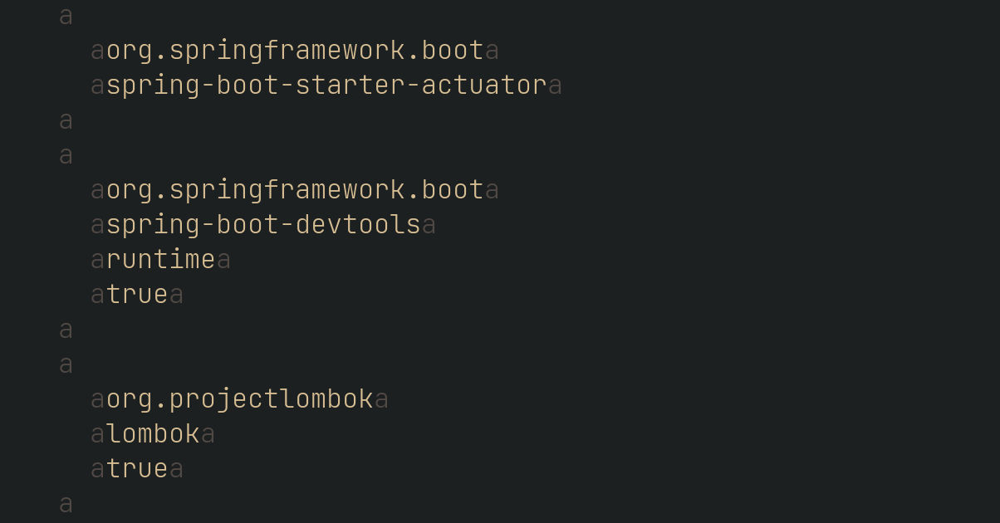

Overview
========

This Vim plugin lets you hide patterns of a buffer's content without modification, using Vim's [conceal](https://vimhelp.org/syntax.txt.html#conceal) feature.

Use
---

Imagine you have a file, full of uninteresting tags and text:

This plugin lets you hide distracting text:

1. Don't want to see "dependency"? You can search for `/dependency`, and then type `:SearchConceal` to conceal all the matches (by default the `:SearchConceal` command uses the pattern in the `@/` register).
2. All matches are concealed with an "a".
3. Maybe you find "Id" too redundant. Type `:SearchConceal b Id` (or some other regular expression)
4. The second match is concealed with a "b".
5. A third concealed pattern uses "c", 4th "d", 5th, "e", etc

Using regular expressions lets you hide arbitrary patterns. For example, hiding the content of all tags with `/<[^>]*>` and the command
`:SearchConceal` (or maybe as a one liner in a script `:SearchConceal a <[^>]*>`):

You might add this to your `~/.vim/after/syntax/xml.vim` to apply the setting
to all your xml files.

When you want to see everything again, type `:SearchConcealClear`.

Commands
--------

**:SearchConceal**

Conceal the current pattern in `@/` with 'a' (or 'b', 'c', etc for each subsequent
call to `:SearchConceal`)

**:SearchConceal char**

Conceal the current pattern in `@/` with `char`

**:SearchConceal char pattern**

Conceal the regular expression `pattern` with `char`

**:SearchConceal char pattern syn-pattern-offset**

Conceal the regular expression `pattern` with `char`, and apply any syntax
matching offset settings from [syn-pattern-offset](https://vimhelp.org/syntax.txt.html#syn-pattern-offset). Note that this plugin uses `syntax match` so `ms` and `me` are the only options that are relevant to this command.

**:SearchConcealClear**

Clears all syntax definitions created by this plugin, un-hiding any concealed
text.

Installation
------------

Use your favorite plugin manager to install the vim-searchconceal.

Vundle:

    Plugin 'dsummersl/vim-searchconceal'

    " Add mappings if desired:
    map <leader>ch :SearchConceal<CR>
    map <leader>cc :SearchConcealClear<CR>

Packer:

    use {'dsummersl/vim-searchconceal', config = function()
      vim.cmd([[
        " Conceal the latest search
        map ,cc :SearchConcealClear<CR>
        map ,ch :SearchConceal<CR>
      ])
    end}
