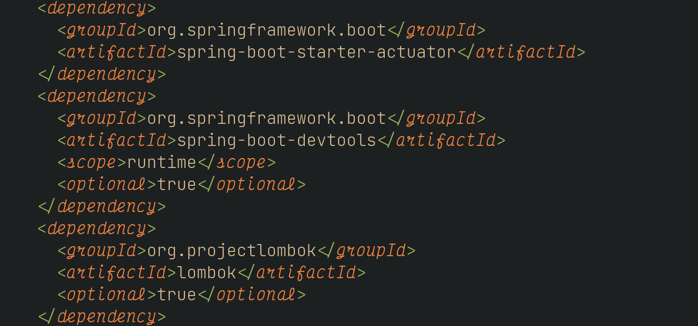

Overview
========

Sometimes you want to hide the things you're searching for, without modifying
the file that you are looking at. This plugin lets you do that, using [conceal](https://vimhelp.org/syntax.txt.html#conceal) to hide the search pattern (`@/`) in the current buffer.

Use
---

1. See something in the file you that is distracting, say "dependency"? Type `:SearchConceal 'dependency'` (or some other regular expression)
2. All matches are concealed with "a".
3. Hide something you searched for, say `/Id`. Type `/Id` to search, and `:SearchConceal` (by default SearchConceal conceals the `@/` register)
4. All matches are concealed with "b".
5. Hide another thing
6. All matches are concealed with "c".
7. Hide another thing
8. You get the idea, I hope!

When you want to un-hide everything, simply type `:SearchConcealClear`

Installation
------------

Use your favorite plugin manager to install the plugin, for instance, Vundle:

    Plugin 'dsummersl/vim-searchconceal'

If desired, add mappings:

    " Conceal the latest search
    map <leader>ch :SearchConceal<CR>
    map <leader>cc :SearchConcealClear<CR>
